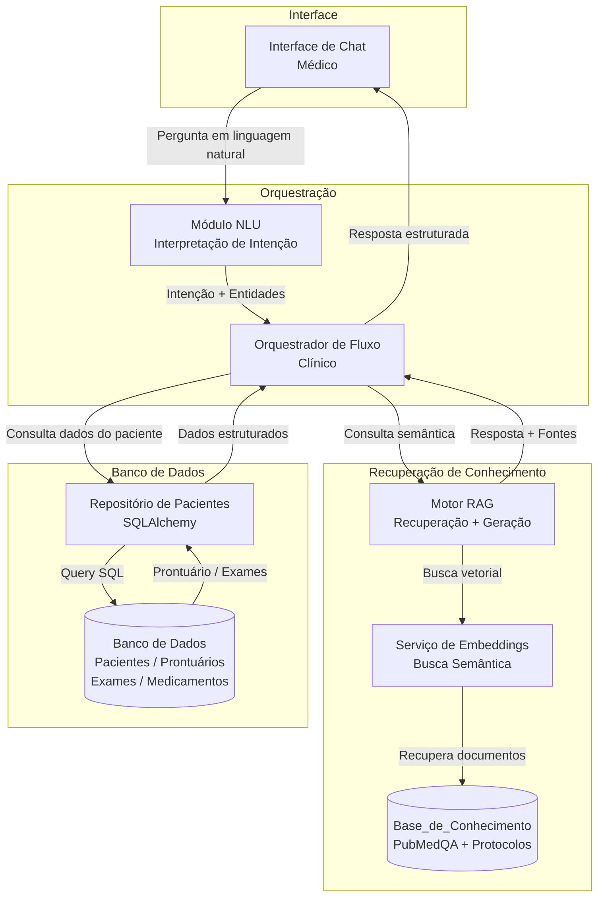
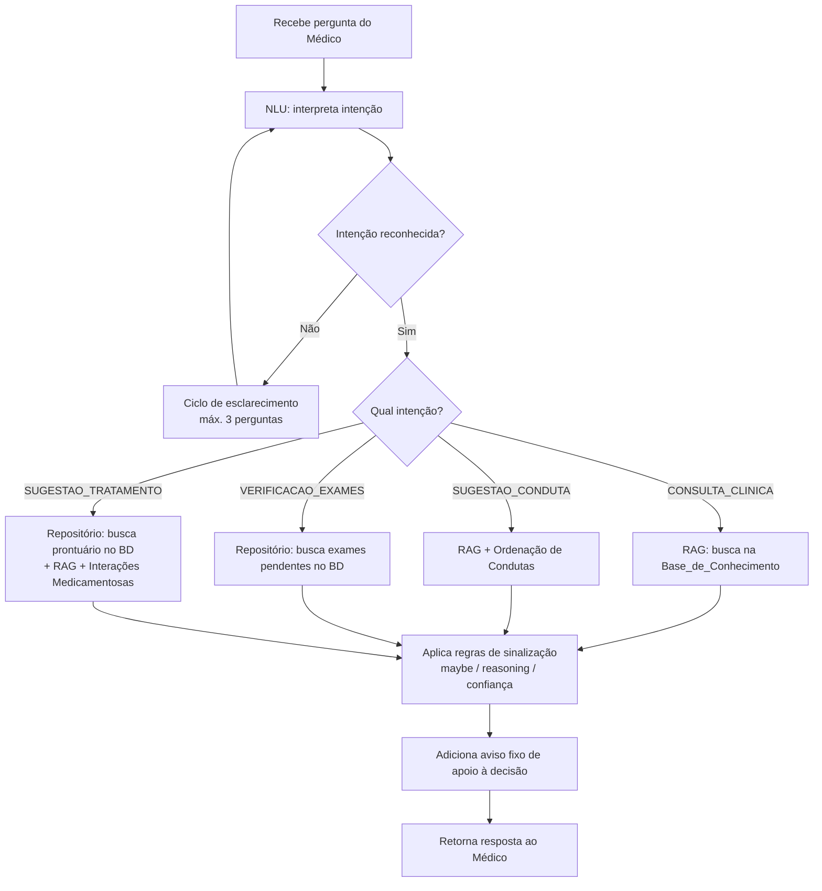

# Design Document — Assistente Virtual Médico Hospitalar

## Overview

O Assistente Virtual Médico Hospitalar é um sistema de suporte à decisão clínica baseado em inteligência artificial que combina recuperação de informação (RAG — Retrieval-Augmented Generation) com processamento de linguagem natural (PLN) para responder perguntas clínicas, sugerir condutas e tratamentos, e verificar exames pendentes de pacientes.

O sistema opera sobre uma **Base_de_Conhecimento** estruturada no formato PubMedQA, composta por artigos científicos indexados com Termos_MeSH, e por Protocolos clínicos internos do hospital. Toda resposta gerada é rastreável às suas fontes e acompanhada de avisos de apoio à decisão.

### Objetivos de Design

- **Rastreabilidade**: toda resposta clínica deve citar explicitamente suas fontes (artigo ou protocolo).
- **Segurança**: respostas com baixa confiança, evidências inconclusivas ou raciocínio complexo devem ser sinalizadas.
- **Personalização**: sugestões de tratamento consideram o perfil individual do paciente (diagnóstico ativo, medicamentos em uso, alergias, comorbidades).
- **Atualização de dados**: informações de pacientes (prontuário, exames, medicamentos) são lidas diretamente do banco de dados interno do sistema.
- **Idioma**: todas as interações são em português do Brasil.

---

## Technology Stack

| Camada | Tecnologia | Justificativa |
|---|---|---|
| Linguagem | Python 3.11+ | Ecossistema maduro para IA/ML, ampla compatibilidade com LangChain e bibliotecas científicas |
| Orquestração LLM | LangChain | Abstração de chains, memória de sessão e integração com vector stores |
| LLM | ChatGPT (OpenAI `gpt-4o` via `ChatOpenAI`) | Capacidade de raciocínio clínico, suporte a português do Brasil e API amplamente disponível |
| Embeddings | OpenAI `text-embedding-3-small` | Boa relação custo/qualidade para busca semântica em textos médicos |
| Vector Store | FAISS | Busca vetorial local eficiente sobre a Base_de_Conhecimento PubMedQA |
| Framework Web | FastAPI | API REST assíncrona com documentação automática |
| Banco de Dados | SQLite (desenvolvimento) / PostgreSQL (produção) | Armazenamento de pacientes, prontuários, exames e medicamentos |
| ORM | SQLAlchemy 2.0 | Acesso ao banco de dados com suporte a queries assíncronas |
| Validação de dados | Pydantic v2 | Modelos de dados tipados para todas as interfaces do sistema |
| Gerenciamento de dependências | `requirements.txt` + `pip` | Simples, sem framework adicional |

### Dependências (`requirements.txt`)

```
openai>=1.30.0
langchain>=0.2.0
langchain-openai>=0.1.0
langchain-community>=0.2.0
faiss-cpu>=1.8.0
fastapi>=0.111.0
uvicorn>=0.30.0
pydantic>=2.7.0
python-dotenv>=1.0.0
httpx>=0.27.0
sqlalchemy>=2.0.0
aiosqlite>=0.20.0
```

### Padrões LangChain Utilizados

- **`ChatOpenAI`**: cliente LangChain para o modelo ChatGPT (`gpt-4o`), configurado com temperatura baixa para respostas clínicas determinísticas
- **`RetrievalQA` / `ConversationalRetrievalChain`**: recuperação de documentos + geração de resposta fundamentada via ChatGPT
- **`FAISS.from_documents`** com filtros de metadados: filtragem por `MESHES`, `final_decision` e `YEAR` diretamente no retriever
- **`ConversationBufferWindowMemory`**: histórico de sessão do médico com janela de contexto configurável
- **`ChatPromptTemplate`**: templates de prompt separados por intenção clínica (consulta, conduta, tratamento)
- **`StructuredOutputParser`**: garante que a resposta do ChatGPT seja parseada nos modelos Pydantic definidos

---

## Architecture

O sistema segue uma arquitetura em camadas, sem integração com sistemas externos de hospital. Todas as informações de pacientes são armazenadas e consultadas diretamente no banco de dados interno do sistema.



### Decisões Arquiteturais

| Decisão | Escolha | Justificativa |
|---|---|---|
| Paradigma de geração | RAG (Retrieval-Augmented Generation) | Garante rastreabilidade das fontes e evita alucinações em contexto clínico |
| Busca na Base_de_Conhecimento | Busca vetorial (embeddings) + filtros por Termos_MeSH | Combina relevância semântica com precisão terminológica médica |
| Ordenação de resultados | Protocolos primeiro, depois artigos por YEAR desc | Prioriza diretrizes institucionais sobre literatura externa |
| Timeout de PLN | 10 segundos | Garante resposta ao usuário mesmo em falhas do serviço de linguagem |
| Dados de pacientes | Banco de dados interno (SQLAlchemy) | Sem dependência de sistemas externos; dados gerenciados pelo próprio sistema |
| Atualização de exames | Leitura direta no banco a cada requisição | Simples e consistente; sem necessidade de polling ou sincronização externa |

---

## Components and Interfaces

### 1. Módulo NLU (Natural Language Understanding)

Responsável por interpretar a pergunta do médico e classificá-la em uma das intenções clínicas reconhecidas.

**Intenções reconhecidas:**
- `CONSULTA_CLINICA` — pergunta clínica geral
- `SUGESTAO_CONDUTA` — solicitação de conduta para quadro clínico descrito
- `VERIFICACAO_EXAMES` — consulta de exames pendentes de paciente
- `SUGESTAO_TRATAMENTO` — solicitação de tratamento personalizado para paciente
- `INTENCAO_DESCONHECIDA` — não mapeável a nenhuma intenção clínica

**Interface:**

```python
class NLUResult:
    intencao: str                  # uma das intenções acima
    entidades: dict                # ex: {"numero_prontuario": "12345", "condicao": "pneumonia"}
    confianca: float               # 0.0 a 1.0
    idioma_detectado: str          # ex: "pt-BR"
    requer_esclarecimento: bool    # True se intenção for INTENCAO_DESCONHECIDA

def interpretar_pergunta(texto: str) -> NLUResult: ...
```

**Regra de esclarecimento:** quando `intencao == INTENCAO_DESCONHECIDA`, o orquestrador inicia um ciclo de até 3 perguntas objetivas de esclarecimento antes de emitir qualquer resposta clínica.

---

### 2. Motor RAG (Retrieval-Augmented Generation)

Núcleo do sistema. Recupera documentos relevantes da Base_de_Conhecimento e gera respostas fundamentadas.

**Interface:**

```python
class DocumentoRecuperado:
    tipo: str                      # "artigo" | "protocolo"
    identificador: str
    titulo: str                    # QUESTION (artigo) ou título do protocolo
    ano: int | None                # YEAR (artigo) ou None (protocolo)
    decisao_final: str | None      # "yes" | "no" | "maybe" | None
    reasoning_required: bool       # reasoning_required_pred == "yes"
    contextos: list[str]           # CONTEXTS relevantes
    meshes: list[str]              # MESHES do artigo
    long_answer: str | None        # LONG_ANSWER quando reasoning_required=True
    score_relevancia: float        # 0.0 a 1.0

class RespostaRAG:
    resposta_texto: str
    documentos: list[DocumentoRecuperado]
    confianca_geral: float
    aviso_baixa_confianca: bool

def recuperar_e_gerar(
    consulta: str,
    filtros_mesh: list[str] | None = None,
    excluir_decisao_final: list[str] | None = None,
    limite: int = 10
) -> RespostaRAG: ...
```

**Regras de filtragem:**
- Artigos com `final_decision == "no"` são excluídos como suporte (Requisito 4.3), podendo ser exibidos como evidência contrária.
- Artigos com `final_decision == "maybe"` são incluídos com sinalização explícita de inconclusividade (Requisito 1.3).
- Artigos com `reasoning_required_pred == "yes"` incluem o campo `LONG_ANSWER` na resposta (Requisito 1.4).

---

### 3. Serviço de Ordenação de Condutas

Aplica a regra de ordenação dos resultados de conduta clínica.

**Interface:**

```python
def ordenar_condutas(
    protocolos: list[DocumentoRecuperado],
    artigos: list[DocumentoRecuperado],
    max_protocolos: int = 5
) -> list[DocumentoRecuperado]:
    """
    Retorna lista ordenada: protocolos primeiro (por cobertura desc),
    depois artigos (por YEAR desc).
    """
    ...
```

---

### 4. Repositório de Pacientes (Database)

Acesso direto ao banco de dados interno para recuperar todas as informações de pacientes. Não há integração com sistemas externos.

**Interface:**

```python
class Prontuario:
    numero: str
    diagnostico_ativo: str | None
    medicamentos_em_uso: list[str]
    alergias: list[str]
    comorbidades: list[str]
    historico_clinico: str | None

class Exame:
    nome: str
    data_solicitacao: date
    solicitante: str
    status: str   # "Solicitado" | "Coletado" | "Em Análise" | "Concluído" | "Cancelado"

class RepositorioPacientes:
    def buscar_prontuario(self, numero_prontuario: str) -> Prontuario | None:
        """Retorna None se o paciente não for encontrado no banco."""
        ...

    def listar_exames_pendentes(self, numero_prontuario: str) -> list[Exame]:
        """Retorna exames com status Solicitado, Coletado ou Em Análise."""
        ...

    def buscar_medicamentos_em_uso(self, numero_prontuario: str) -> list[str]:
        """Retorna lista de medicamentos em uso registrados no banco."""
        ...
```

**Tabelas do banco de dados:**

| Tabela | Campos principais |
|---|---|
| `pacientes` | `numero_prontuario`, `nome`, `data_nascimento` |
| `prontuarios` | `numero_prontuario`, `diagnostico_ativo`, `alergias`, `comorbidades`, `historico_clinico` |
| `exames` | `id`, `numero_prontuario`, `nome`, `data_solicitacao`, `solicitante`, `status` |
| `medicamentos` | `id`, `numero_prontuario`, `nome_medicamento`, `data_inicio`, `ativo` |

---

### 5. Serviço de Interações Medicamentosas

Verifica interações entre tratamento sugerido e medicamentos em uso do paciente.

**Interface:**

```python
class InteracaoMedicamentosa:
    medicamento_a: str
    medicamento_b: str
    severidade: str   # "leve" | "moderada" | "grave"
    descricao: str

def verificar_interacoes(
    tratamento_sugerido: list[str],
    medicamentos_em_uso: list[str]
) -> list[InteracaoMedicamentosa]:
    """Lança ServiceUnavailableError se o serviço estiver indisponível."""
    ...
```

---

### 6. Orquestrador de Fluxo Clínico

Coordena todos os componentes e aplica as regras de negócio.



---

## Data Models

### Base_de_Conhecimento — Entrada PubMedQA

```python
class EntradaPubMedQA:
    id: str                          # Identificador único do artigo
    QUESTION: str                    # Pergunta clínica
    CONTEXTS: list[str]              # Trechos de contexto extraídos do artigo
    LABELS: list[str]                # Rótulos de seção para cada contexto
    MESHES: list[str]                # Termos MeSH
    YEAR: int                        # Ano de publicação
    reasoning_required_pred: str     # "yes" | "no"
    final_decision: str              # "yes" | "no" | "maybe"
    LONG_ANSWER: str                 # Justificativa longa da decisão
```

### Protocolo Clínico Interno

```python
class Protocolo:
    id: str                          # Identificador único
    titulo: str                      # Título do protocolo
    nivel_evidencia: str             # Ex: "A", "B", "C" ou "I", "II", "III"
    condicoes_aplicaveis: list[str]  # Condições clínicas cobertas
    contraindicacoes: list[str]      # Contraindicações listadas
    termos_emergencia: list[str]     # Termos classificados como emergência/urgência
    vigente: bool                    # Se o protocolo está em vigor
```

### Resposta Clínica Estruturada

```python
class RespostaClinica:
    texto_resposta: str
    fontes: list[FonteReferencia]
    avisos: list[Aviso]
    confianca: float
    timestamp: datetime

class FonteReferencia:
    tipo: str                        # "artigo" | "protocolo"
    identificador: str
    titulo: str
    ano: int | None
    decisao_final: str | None

class Aviso:
    tipo: str                        # "baixa_confianca" | "evidencia_inconclusiva" |
                                     # "raciocinio_necessario" | "emergencia" |
                                     # "apoio_decisao" | "fora_protocolo"
    mensagem: str
    destaque: bool                   # True para emergências
```

### Estado de Sessão do Médico

```python
class SessaoMedico:
    id_sessao: str
    id_medico: str
    historico_perguntas: list[str]
    contador_esclarecimentos: int    # Máximo 3 por ciclo de intenção desconhecida
    idioma: str                      # "pt-BR"
    timestamp_inicio: datetime
```

---

## Correctness Properties

*Uma propriedade é uma característica ou comportamento que deve ser verdadeiro em todas as execuções válidas de um sistema — essencialmente, uma declaração formal sobre o que o sistema deve fazer. As propriedades servem como ponte entre especificações legíveis por humanos e garantias de correção verificáveis por máquina.*

### Property 1: Toda resposta clínica contém ao menos uma fonte rastreável

*Para qualquer* pergunta clínica válida respondida com base na Base_de_Conhecimento, a resposta gerada deve conter ao menos uma fonte identificada — artigo com `id`, `QUESTION` e `YEAR`, ou protocolo com `id` e `título`.

**Validates: Requirements 1.2**

---

### Property 2: Evidências inconclusivas são sempre sinalizadas com contextos

*Para qualquer* artigo científico com `final_decision == "maybe"` incluído em uma resposta clínica, a resposta deve conter um aviso explícito de inconclusividade **e** apresentar os trechos de contexto (CONTEXTS) relevantes desse artigo.

**Validates: Requirements 1.3**

---

### Property 3: Artigos com raciocínio necessário sempre exibem LONG_ANSWER

*Para qualquer* artigo científico com `reasoning_required_pred == "yes"` incluído em uma resposta clínica, a resposta deve conter o campo `LONG_ANSWER` desse artigo e uma indicação de que a interpretação requer raciocínio clínico adicional.

**Validates: Requirements 1.4**

---

### Property 4: Artigos com Decisão_Final "no" nunca aparecem como suporte a tratamentos

*Para qualquer* sugestão de tratamento gerada pelo sistema, nenhum artigo científico com `final_decision == "no"` deve aparecer na lista de suporte à sugestão. Tais artigos podem aparecer apenas como evidência contrária, se relevante para o quadro clínico.

**Validates: Requirements 4.3**

---

### Property 5: Ordenação e limite de condutas clínicas respeitam a hierarquia protocolo-artigo

*Para qualquer* lista de sugestões de conduta clínica gerada a partir de um quadro clínico, todos os protocolos vigentes devem aparecer antes de qualquer artigo científico; os artigos devem estar ordenados de forma decrescente pelo campo `YEAR`; e o número de protocolos exibidos deve ser no máximo 5, ordenados de forma decrescente pelo número de características clínicas correspondentes ao escopo de cada protocolo.

**Validates: Requirements 2.4, 2.6**

---

### Property 6: Verificação de segurança do tratamento cobre interações e contraindicações

*Para qualquer* sugestão de tratamento gerada quando o prontuário do paciente contém ao menos um medicamento em uso registrado, a resposta deve incluir: (a) a lista de interações medicamentosas identificadas entre o tratamento sugerido e os medicamentos em uso (podendo ser vazia); e (b) a lista de contraindicações identificadas com base nas alergias, comorbidades e histórico clínico registrados no prontuário.

**Validates: Requirements 4.5, 4.8**

---

### Property 7: Exames pendentes retornam apenas registros com status correto e campos completos

*Para qualquer* consulta de exames pendentes de um paciente cadastrado, a lista retornada deve conter exclusivamente exames com status `Solicitado`, `Coletado` ou `Em Análise` — nunca `Concluído` ou `Cancelado` — e cada exame deve apresentar os campos: nome, data de solicitação, nome do solicitante e status atual.

**Validates: Requirements 3.1, 3.2**

---

### Property 8: Aviso fixo de apoio à decisão está presente em toda resposta clínica

*Para qualquer* resposta clínica gerada pelo sistema (consulta, conduta ou tratamento), a resposta deve conter o aviso fixo indicando que as sugestões são de apoio à decisão e não substituem o julgamento clínico do médico.

**Validates: Requirements 1.7**

---

### Propriedade 9: Campos ausentes no prontuário bloqueiam sugestão de tratamento com indicação precisa

*Para qualquer* solicitação de sugestão de tratamento em que o prontuário do paciente não contenha ao menos um dos campos obrigatórios (diagnóstico ativo, medicamentos em uso ou alergias), o sistema deve informar ao médico exatamente quais campos estão ausentes e não gerar nenhuma sugestão de tratamento.

**Validates: Requirements 4.9**

---

### Propriedade 10: Respostas com confiança abaixo do limiar exibem aviso de baixa confiança

*Para qualquer* resposta clínica gerada, o campo `aviso_baixa_confianca` deve ser `True` se e somente se o `score de confiança` da resposta for inferior ao limiar configurado no sistema — e `False` caso contrário.

**Validates: Requirements 1.6**

---

### Propriedade 11: Ciclo de esclarecimento nunca ultrapassa 3 perguntas por intenção desconhecida

*Para qualquer* sequência de interações em que o assistente não consiga mapear a pergunta do médico a uma intenção clínica reconhecida, o número de perguntas de esclarecimento emitidas pelo assistente antes de encerrar o ciclo deve ser sempre menor ou igual a 3.

**Validates: Requirements 1.8**

---

### Propriedade 12: Completude de campos obrigatórios nas fontes de condutas clínicas

*Para qualquer* sugestão de conduta clínica gerada, toda fonte do tipo protocolo deve apresentar: identificador, título, nível de evidência e contraindicações; e toda fonte do tipo artigo deve apresentar: identificador, QUESTION, Decisão_Final e ao menos um trecho de CONTEXTS relevante.

**Validates: Requirements 2.2, 2.3**

---

### Propriedade 13: Correspondência MeSH entre quadro clínico e documentos recuperados

*Para qualquer* quadro clínico ou diagnóstico ativo descrito pelo médico, todos os artigos científicos recuperados como sugestão de conduta ou tratamento devem ter ao menos um Termo_MeSH que corresponda às condições clínicas descritas no quadro ou ao diagnóstico ativo registrado no prontuário.

**Validates: Requirements 2.1, 4.1**

---

### Propriedade 14: Exames retornados refletem o estado atual do banco de dados

*Para qualquer* consulta de exames pendentes, os dados retornados devem refletir o estado atual da tabela `exames` no banco de dados no momento da requisição — sem cache intermediário ou dados desatualizados.

**Validates: Requirements 3.5**

---

### Propriedade 15: Emergências são destacadas antes de todas as outras sugestões

*Para qualquer* quadro clínico que contenha ao menos um termo explicitamente classificado como emergência ou urgência nos protocolos do hospital, a sugestão de conduta clínica correspondente deve aparecer em destaque visual diferenciado e antes de quaisquer outras sugestões, acompanhada da recomendação de acionamento imediato da equipe de emergência.

**Validates: Requirements 2.5**

---

## Error Handling

| Cenário de Erro | Comportamento Esperado | Requisito |
|---|---|---|
| Base_de_Conhecimento indisponível | Informa indisponibilidade; não retorna resposta clínica parcial | 1.10 |
| Timeout do serviço de PLN (> 10s) | Cancela requisição; informa o médico sobre o timeout | 1.11 |
| Número de prontuário não encontrado no BD | Exibe "Paciente não encontrado"; solicita correção | 3.3 |
| Nenhum exame pendente no BD | Exibe "Nenhum exame pendente encontrado para este paciente" | 3.4 |
| Serviço de interações indisponível | Bloqueia exibição da sugestão de tratamento; solicita nova tentativa | 4.7 |
| Nenhum protocolo ou artigo cobre o quadro | Informa ausência de evidência; recomenda consulta a especialista | 2.7 |
| Confiança abaixo do limiar configurado | Exibe aviso de baixa confiança junto à resposta | 1.6 |
| Intenção não reconhecida | Inicia ciclo de esclarecimento (máx. 3 perguntas) | 1.8 |
| Prontuário sem campos obrigatórios no BD | Informa campos ausentes; bloqueia sugestão de tratamento | 4.9 |
| Falha de conexão com o banco de dados | Informa indisponibilidade temporária; não retorna dados parciais | 3.1, 4.1 |

### Estratégia de Resiliência

- **Circuit Breaker** para o serviço de PLN (ChatGPT): após 3 falhas consecutivas, o circuito abre e retorna erro imediato por 30 segundos antes de tentar novamente.
- **Retry com backoff exponencial** para o serviço de interações medicamentosas: até 3 tentativas com intervalos de 1s, 2s e 4s.
- **Retry simples** para falhas de conexão com o banco de dados: até 3 tentativas com intervalo de 1 segundo entre cada.


